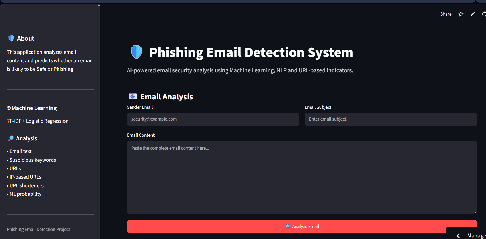
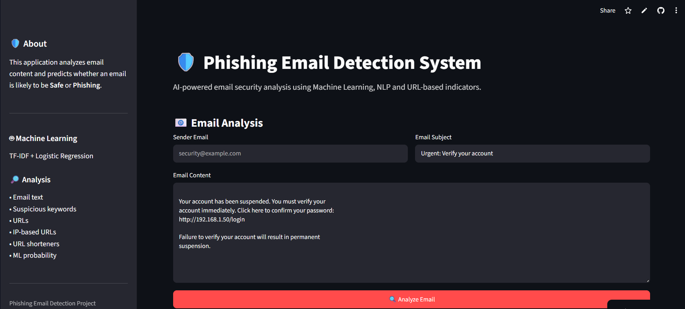
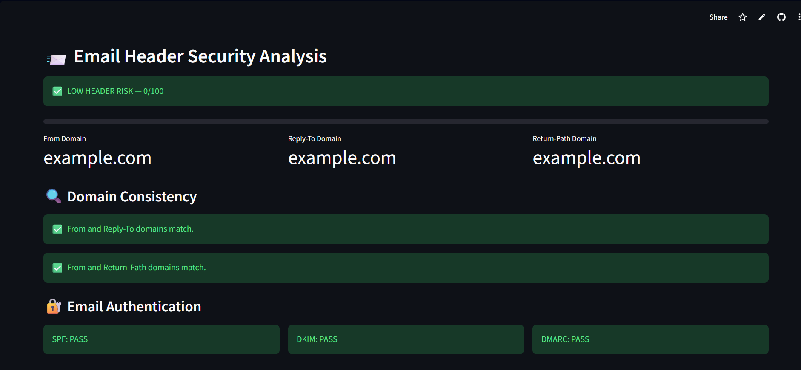
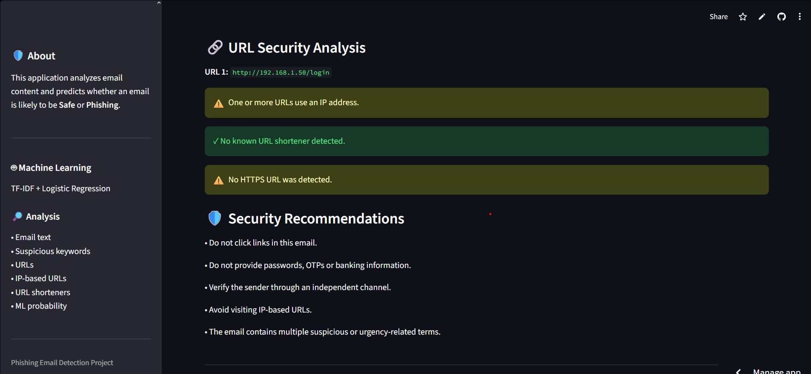

# 🛡️ Phishing Email Detection System

## 🔗 Live DEMO

https://phishing-email-detector-mbqng6makghtsbv3scovww.streamlit.app

## 📸 Screenshots

### 🏠 Homepage

### 🚨 Phishing Detection Result

### 🔎 Feature Analysis

### 📊 Model Performance

## 📌 Overview

The Phishing Email Detection System is a machine-learning-based
cybersecurity application that analyzes email content and predicts
whether an email is likely to be Safe or Phishing.

The system combines Natural Language Processing (NLP), TF-IDF
text features, URL analysis, suspicious keyword detection and
Logistic Regression classification.

## ✨ Features

- 📧 Email content analysis
- 🤖 Machine learning classification
- 🔎 TF-IDF based NLP
- 🔗 URL detection
- ⚠️ Suspicious keyword detection
- 🌐 IP-based URL detection
- 🔗 URL shortener detection
- 🔐 HTTPS detection
- 📊 Phishing probability
- 🎯 Risk score from 0–100
- 🚦 Risk classification
- 📈 Accuracy, Precision, Recall and F1 Score
- 📊 Confusion Matrix
- 📄 Downloadable security report
- ☁️ Cloud deployment

## 🧠 Machine Learning

### Algorithm

Logistic Regression

### Text Representation

TF-IDF (Term Frequency-Inverse Document Frequency)

### Additional Features

- URL count
- Suspicious keyword count
- HTTPS presence
- IP-based URL detection
- URL shortener detection
- Suspicious language indicators

## 📂 Dataset

The model is trained using a labeled phishing email dataset
containing both safe and phishing emails.

Dataset source:

https://huggingface.co/datasets/zefang-liu/phishing-email-dataset

## ⚙️ Project Architecture

User
↓
Streamlit Interface
↓
Email Input
↓
Feature Engineering
↓
TF-IDF
↓
Logistic Regression
↓
Prediction Probability
↓
Risk Scoring
↓
Security Analysis
↓
Safe / Phishing Result

## 📊 Model Performance

Add your actual values here after training:

| Metric | Score |
|---|---:|
| Accuracy | XX% |
| Precision | XX% |
| Recall | XX% |
| F1 Score | XX% |

## 🛠️ Technologies

- Python
- Scikit-learn
- Pandas
- NumPy
- Matplotlib
- Streamlit
- Joblib
- Git
- GitHub

## 💻 Installation

Clone the repository:

git clone https://github.com/gursharan201205gill-lab/phishing-email-detector

Enter the project directory:

cd phishing-email-detector

Create a virtual environment:

python -m venv venv

Activate it on Windows:

.\venv\Scripts\Activate.ps1

Install dependencies:

pip install -r requirements.txt

Run the application:

streamlit run app.py

## 🔍 Example

Example suspicious email:

Subject:
Urgent: Verify Your Account

Email:
Your account has been suspended.
Verify your password immediately by clicking
the link below.

The application analyzes:

- Text
- URLs
- Suspicious keywords
- URL characteristics
- ML probability

and produces a risk assessment.

## ⚠️ Disclaimer

This application is intended for educational and research purposes.
It provides an automated risk assessment and may produce false
positives or false negatives.

Users should independently verify suspicious emails and should
never provide credentials or sensitive information based solely
on the application's prediction.

## 🚀 Future Improvements

- Real-time URL reputation checking
- Domain reputation analysis
- Sender-domain analysis
- SPF/DKIM/DMARC analysis
- HTML email analysis
- Attachment analysis
- Explainable AI
- Deep learning models
- Transformer-based email classification
- Email header analysis
- PDF security reports
- Database for analysis history

## 👩‍💻 Author

Gursharan Kaur Gill

## ⭐ Project

Phishing Email Detection System